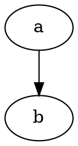
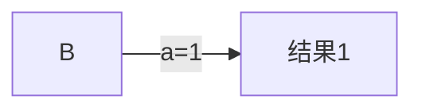
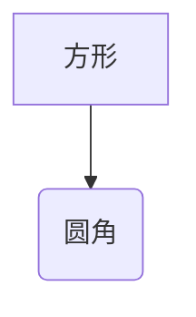

***
 


$$\text{This is LaTex}$$
$$
\sum_{i=1}^n (a_i*3)+\frac{\sum_{i=1}^n (a_i*3)}{6}
$$

$$
a=a_1+a_2+a_3+\dots+a_n=\sum_{i=1}^n a_i
$$

$$
\begin{aligned}
    a &= b + c \\
    &= 4   
\end{aligned}
$$

$$\begin{matrix}1&2&3\\
                4&5&6\\
                7&8&9
\end{matrix},\begin{pmatrix}1&2&3\\
                4&5&6\\
                7&8&9
\end{pmatrix},\text{end here}$$

$$\color{green}{  
\begin{matrix}1&2&3\\
            4&5&6\\
            7&8&9
\end{matrix},\begin{pmatrix}1&2&3\\
            4&5&6\\
            7&8&9
\end{pmatrix},\text{end here}
}$$

***
$$\text{can table be this?}$$
$$\text{can't}$$
 
***

 
 



***

***

***

```flow
st=>start: 开始 
op=>operation: 处理 
cond=>condition: 判断 
e=>end: 结束框
st(right)->op(right)->cond
cond(yes)->e
```
 <style>
.box{width: 100px;height: 100px;border: 1px solid red;

background-color: green;
filter: opacity(50%);
transition: all 1.1s;
border-radius: 20%;
margin:0 auto;
position:fixed;
top:100px;
right:100px;
}
.box:hover{transform: translateY(7px) translateX(7px) rotate(360deg);
filter:opacity(70%)
}

table{margin:0 auto;
    width: 100px;height: 100px;
    border:1px solid red;
}

</style>
<div class="box"></div>
 
 <table></table>